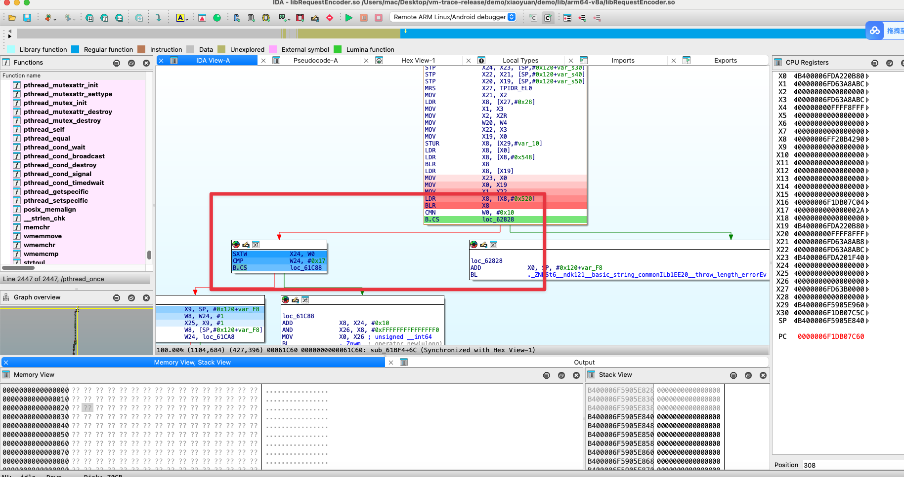
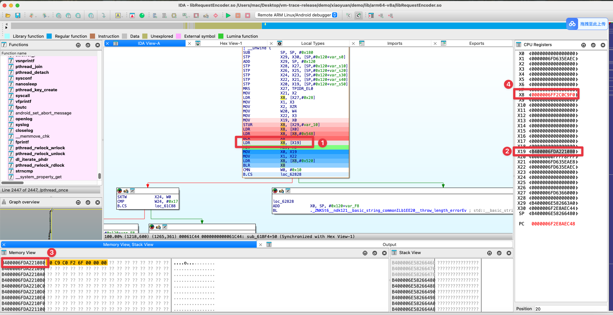
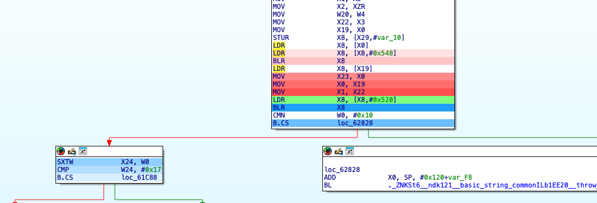
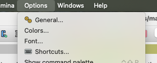
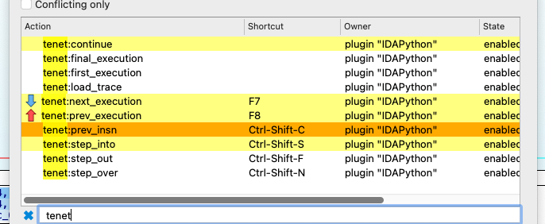

# 效果图

## 对抗虚假控制流、各种未知的混淆，可以使用单步执行



## 分析算法可便捷查看内存变化信息




## 支持向上单步，向下单步，时间回溯



红色为已经走过的路径，蓝色为未来要走的

我们能明确知道，BLR X8跳转到了B.CS 并且知道B.CS向左分支跳转


# 我改动了哪些地方

1. 支持了ARCH64架构的格式导入
2. 解决了ALSR的识别
3. 增加了单步调试等多个快捷键
4. 修复了大大小小原来出现的bug
5. 支持了ida9.0
6. 美化了UI


# 如何使用

1. 安装插件

   `import idaapi, os; os.path.join(idaapi.get_user_idadir(), "plugins")`

   ida python输入后得到路径

   把tenet文件夹和py文件一起放到文件夹里

2. 打开demo文件夹，将so拖入ida
3. IDA窗口左上角 File->Load File -> Tenet Trace File 打开 log.txt
4. 右下角Position输入1 开始最初的Trace 或者快捷键 Ctrl+shift+S /Ctrl+shift+N


# 快捷键问题



Shortcuts



prev_insn 回到上一个位置

step_into 步入

Step_out 步出函数（有bug)

step_over 步过

Next_execution 下一个时间点（需要鼠标选中位置）

比如一个

```
for(int i=0;i<10;i++){
		printf(i);
}
```

我们当前的i是0

我们在printf使用Next_execution 那么下一次i=1

在下一次以此类推


## 更多实用技巧（作者原本的）

https://blog.ret2.io/2021/04/20/tenet-trace-explorer/


# Trace格式

https://github.com/gaasedelen/tenet/tree/master/tracers


但是我的Trace有ALSR的定制，请按照demo文件夹的第一行输出即可

其他的和作者保持一致